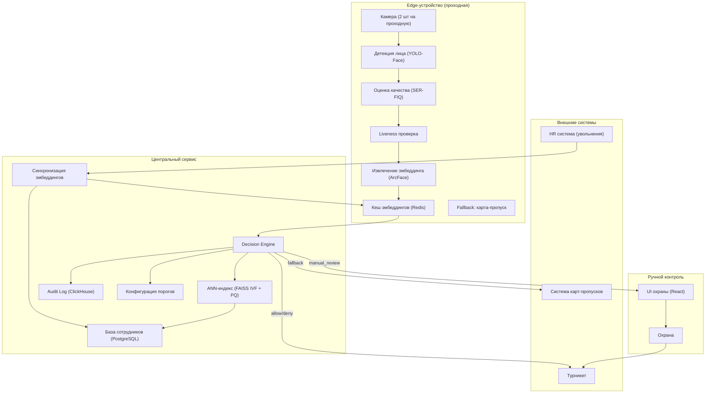

# Архитектура системы распознавания лиц на проходной

---

## 1. Общая архитектура

Система построена по гибридной архитектуре с распределением вычислительной нагрузки между Edge-устройствами (на проходных) и центральным облачным сервисом. Такой подход выбран для обеспечения минимальной задержки (менее 1 секунды), отказоустойчивости при потере сети и возможности масштабирования на несколько проходных и площадок.

---

## 2. Схема компонентов



---

## 3. Детальное описание компонентов

### 3.1. Edge-устройство (проходная)

Edge-устройство представляет собой промышленный компьютер с GPU (NVIDIA Jetson или аналоги) и устанавливается на каждой проходной. Оно обрабатывает видеопоток с двух камер и выполняет первый этап пайплайна.

**3.1.1. Камера (2 шт на проходную)**
- Разрешение: 1080p (1920×1080) или 4K
- Частота кадров: 30 fps
- Поддержка ИК-подсветки для работы в темное время суток
- Угол обзора: 60-90 градусов для захвата лица в зоне турникета
- Расположение: на высоте 1.5-1.7 м, направлена в зону прохода

**3.1.2. Детекция лица (YOLO-Face)**
- Модель: YOLO-Face (предобученная на WIDER Face)
- Вход: кадр с камеры (1080p)
- Выход: координаты bounding box для каждого лица (x, y, w, h)
- Время: < 50 мс на кадр
- Находит все лица на кадре (обычно 1-2, при "паровозике" до 5)
- Отбрасывает лица с низкой уверенностью (< 0.5)

**3.1.3. Оценка качества кадра (SER-FIQ)**
- Модель: SER-FIQ (предобученная)
- Вход: вырезанное лицо (из bounding box)
- Выход: score от 0 до 1 (качество)
- Критерии: размер лица (> 60px), резкость (вариация Лапласа > 100), освещенность (средняя яркость > 30 и < 220), угол поворота (roll, pitch, yaw < 30 градусов)
- Если quality < 0.7 → сразу manual_review (без попытки распознавания)

**3.1.4. Liveness проверка (anti-spoofing)**
- Комбинация методов:
    - Texture analysis (LBP, BRISK) — обнаружение фото/печати
    - Motion detection (optical flow) — обнаружение микро-движений (моргание, поворот)
    - Depth estimation (MediaPipe) — обнаружение плоских объектов (фото/видео на экране)
- Выход: liveness_score от 0 до 1
- Если liveness_score < 0.8 → manual_review

**3.1.5. Извлечение эмбеддинга (ArcFace)**
- Модель: ArcFace (предобученная на MS1M)
- Вход: вырезанное лицо (выровненное по глазам)
- Выход: вектор размерностью 512 (float32)
- Время: < 100 мс
- Нормализация: L2-нормализация (косинусное сходство)

**3.1.6. Кеш эмбеддингов (Redis)**
- Хранит эмбеддинги топ-1000 сотрудников по частоте проходов
- Обновляется ежечасно из центрального сервиса
- Используется для локального поиска без обращения в центр
- При потере сети — система работает на кеше с повышенным порогом (0.8)

**3.1.7. Fallback: карта-пропуск**
- При сбое системы (низкое качество, liveness, потеря сети, timeout > 2 сек) — автоматический переход на карту-пропуск
- Охрана может принудительно переключить проходную в режим карт

---

### 3.2. Центральный сервис

Центральный сервис работает в облаке (или в ЦОД) и обеспечивает управление базой сотрудников, поиск по эмбеддингам, принятие решений, аудит и синхронизацию.

**3.2.1. ANN-индекс (FAISS IVF + PQ)**
- Технология: FAISS (Facebook AI Similarity Search)
- Индекс: IVF (Inverted File) + PQ (Product Quantization)
- Размерность: 512
- Количество центроидов: 256
- Время поиска: < 200 мс на 12 000 векторов
- Поддержка масштабирования до 100 000+ векторов (несколько площадок)
- Перестраивается при изменении базы сотрудников (ежечасно)

**3.2.2. База сотрудников (PostgreSQL)**
- Хранит информацию о сотрудниках: ID, имя, отдел, статус (активен/уволен), дата регистрации, согласие на биометрию
- Хранит эмбеддинги (в отдельной таблице с шифрованием AES-256)
- Индексы по статусу и отделу для быстрых запросов
- Ежечасная синхронизация с HR-системой (увольнения, новые сотрудники)

**3.2.3. Decision Engine**
- Принимает решение на основе:
    - match_score (косинусное сходство эмбеддинга с найденным в базе)
    - margin_to_second_best (разница между лучшим и вторым кандидатом)
    - quality_score (оценка качества кадра)
    - liveness_score (оценка liveness)
- Пороги:
    - allow: match_score >= 0.75 AND liveness_score >= 0.8 AND quality_score >= 0.7 AND margin_to_second_best >= 0.1
    - manual_review: (0.55 <= match_score < 0.75) OR (liveness_score < 0.8) OR (quality_score < 0.7) OR (margin_to_second_best < 0.1)
    - deny: match_score < 0.55 OR detected_spoof
- При match_score между 0.55 и 0.75 — отправляется на ручную проверку с указанием двух лучших кандидатов
- При offline-режиме порог allow повышается до 0.8 (снижение FAR)

**3.2.4. Audit Log (ClickHouse)**
- Хранит все события доступа:
    - event_id, timestamp, gate_id, camera_id, employee_id (если найден)
    - decision (allow / manual_review / deny), match_score, quality_score, liveness_score
    - frame_uri (ссылка на кадр, если требуется расследование)
    - latency_ms (полное время обработки)
- Retention: 5 лет (требование регулятора)
- Защита от изменения: append-only, криптографическая подпись (SHA-256)
- Доступ только для уполномоченных лиц (безопасность, HR)

**3.2.5. Синхронизация эмбеддингов**
- Ежечасная синхронизация между центральной базой и edge-кешем
- При увольнении сотрудника: немедленный invalidate в центре, edge получает при следующей синхронизации (макс 1 час)
- Отслеживание изменений: versioning (у каждого эмбеддинга есть версия)

---

## 4. Поток данных

### 4.1. Синхронный горячий путь (от кадра до турникета)

```
1. Кадр с камеры (30 fps)
   ↓
2. Детекция лица (YOLO-Face) — 50 мс
   → Найдено лицо? Нет → manual_review
   ↓
3. Оценка качества (SER-FIQ) — 30 мс
   → quality_score >= 0.7? Нет → manual_review
   ↓
4. Liveness проверка — 100 мс
   → liveness_score >= 0.8? Нет → manual_review
   ↓
5. Извлечение эмбеддинга (ArcFace) — 100 мс
   ↓
6. Поиск в базе (FAISS) — 200 мс
   → Поиск в edge-кеше (если есть) → 50 мс
   → Или поиск в центре → 200 мс
   ↓
7. Decision Engine — 10 мс
   → match_score >= 0.75 → allow
   → 0.55 <= match_score < 0.75 → manual_review
   → match_score < 0.55 → deny
   ↓
8. Команда турникету (allow/deny) или отправка на ручную проверку — 50 мс
   ↓
9. Запись в Audit Log (асинхронно) — 50 мс

Итого: < 1000 мс (p95)
```

### 4.2. Асинхронные части

- Репликация базы сотрудников на edge (ежечасная, фоновая)
- Обновление ANN-индекса при изменении базы (ежечасная, фоновая)
- Сбор и агрегация метрик для мониторинга (ежеминутная)
- Обработка delayed labels (ручные проверки охраны, жалобы сотрудников) — ежедневная
- Очистка устаревших данных (уволенные сотрудники) — ежедневная

### 4.3. Offline-режим (при потере сети)

```
1. Кадр с камеры
   ↓
2. Детекция лица (локально на edge)
   ↓
3. Оценка качества (локально на edge)
   ↓
4. Liveness проверка (локально на edge)
   ↓
5. Извлечение эмбеддинга (локально на edge)
   ↓
6. Поиск в edge-кеше (Redis, топ-1000 сотрудников)
   → Найден в кеше и match_score >= 0.8 → allow (повышенный порог)
   → Найден в кеше и 0.6 <= match_score < 0.8 → manual_review (охрана на месте или карта)
   → Не найден в кеше → deny или карта
   ↓
7. Команда турникету или карта
   ↓
8. Логирование локально (буферизация)
   ↓
9. Синхронизация логов после восстановления сети (в фоне)
```

---

## 5. Пороги и их обоснование

| Порог | Значение | Обоснование |
|-------|----------|-------------|
| match_score для allow | >= 0.75 | FAR < 0.01% при FRR ~1% на тестовых данных (LFW, IJB-C) |
| match_score для manual_review | 0.55 - 0.75 | Зона неопределенности, требуется ручная проверка |
| match_score для deny | < 0.55 | Четко не совпадает с базой, доступ запрещен |
| margin_to_second_best | >= 0.1 | Предотвращает открытие при двух близких кандидатах |
| quality_score | >= 0.7 | Обеспечивает достаточное качество для распознавания |
| liveness_score | >= 0.8 | Защита от spoofing (фото, видео, 3D-маски) |
| allow в offline-режиме | >= 0.8 | Повышенный порог для снижения FAR при потере сети |

**Баланс FAR/FRR:**
- Целевой FAR: < 0.01% (1 на 10 000 проходов) — цена false accept оценивается как инцидент безопасности
- Целевой FRR: < 1% (1 на 100 проходов) — цена false reject — очередь в пик и недовольство сотрудников
- EER (Equal Error Rate) на тестовых данных: ~0.5%

---

## 6. Хранилища и политики

### 6.1. Типы хранимых данных

| Тип данных | Хранится | Срок хранения | Шифрование |
|------------|----------|---------------|------------|
| Эмбеддинги (512 dim) | Да | До увольнения + 30 дней | AES-256 |
| Исходные изображения | Нет | - | - |
| Audit-логи | Да | 5 лет | SHA-256 подпись |
| Метаданные сотрудника | Да | Бессрочно (персональные данные) | AES-256 |
| Кадры для расследования | Да (при инциденте) | 90 дней | AES-256 |

### 6.2. Политика удаления

- При увольнении сотрудника: эмбеддинг удаляется из базы в центре в течение 1 часа (немедленный invalidate)
- Edge-узлы получают обновление при следующей синхронизации (макс 1 час)
- Через 30 дней после увольнения все данные сотрудника удаляются полностью (согласие на биометрию истекло)
- Исходные кадры для расследования: хранятся 90 дней, затем удаляются

### 6.3. Доступ к данным

- К базе эмбеддингов: только уполномоченные сервисы через API с токенами (service-to-service)
- К Audit-логам: только безопасность и HR по запросу (с двухфакторной аутентификацией)
- К исходным кадрам: только при расследовании инцидента (с согласия руководителя безопасности)
- Прямой доступ к базе данных запрещен (только через API)

---

## 7. Интеграции

### 7.1. Интеграция с турникетом

- Команды: `open`, `close`, `status`
- Время выполнения: < 100 мс
- Идемпотентность: каждая команда имеет уникальный ID (нельзя открыть дважды)
- Fallback: при недоступности турникета — уведомление охране, переход на карту

### 7.2. Интеграция с системой карт-пропусков

- Используется как fallback при сбоях или ручном запросе охраны
- Синхронизация статуса карт: при выдаче/отзыве карты обновляется в базе
- При проходе по карте (fallback) — аудит события с отметкой "card_fallback"

### 7.3. Интеграция с HR-системой

- Ежечасная синхронизация списка сотрудников (прием, увольнение, перевод)
- При увольнении: немедленный invalidate доступа (в центре)
- При приеме: добавление в базу после подписания согласия на биометрию

### 7.4. API для внешнего доступа

- REST API для интеграции с внешними системами
- Требования: TLS 1.2+, аутентификация по JWT, rate limiting (100 запросов/сек)
- Контракт: описан в отдельном документе (api-spec.yaml)

---

## 8. Запасные пути при сбоях

| Сбой | Действие | Время восстановления |
|------|----------|----------------------|
| Потеря сети на edge | Offline-режим (кеш) | До восстановления сети |
| Недоступность центрального ANN | Fallback на edge-кеш (даже если не топ-1000) | До 1 часа |
| Недоступность базы данных | Использовать кеш (Redis) | До 5 минут |
| Недоступность турникета | Уведомление охране, ручное открытие | 2 минуты |
| Недоступность камеры | Использовать вторую камеру на проходной | Мгновенно |
| Сбой модели на edge | Переход на центральный сервис | До 1 минуты |
| Общая недоступность системы | Полный fallback на карты-пропуска | До восстановления |

---

## 9. Масштабирование

### 9.1. Горизонтальное масштабирование

- Центральный сервис: горизонтальное масштабирование (ReplicaSet) до 10 реплик
- ANN-индекс: шардирование по площадкам (каждая площадка — отдельный индекс)
- База данных: read replicas для распределения нагрузки
- Edge-узлы: независимые, не требуют синхронизации между собой

### 9.2. Вертикальное масштабирование

- Edge-устройства: замена на более мощные GPU при росте нагрузки
- Центральный сервис: увеличение RAM и CPU для ANN-индекса

### 9.3. Пределы масштабирования

- Один ANN-индекс: до 100 000 векторов (sub-second поиск)
- При росте > 100 000: шардирование по площадкам
- Один edge-кеш: до 5 000 векторов (ограничение памяти)
- Количество проходных: без ограничений (каждая проходная — независимый edge)

---

## 10. Безопасность

### 10.1. Защита данных

- Все эмбеддинги хранятся в зашифрованном виде (AES-256-GCM)
- Ключи шифрования хранятся в отдельном сервисе (HashiCorp Vault)
- Аудит доступа к эмбеддингам (кто, когда, зачем)

### 10.2. Защита API

- TLS 1.3 для всех внешних соединений
- JWT-токены с коротким сроком жизни (1 час)
- Rate limiting на всех endpoint-ах

### 10.3. Защита от spoofing

- Texture analysis (LBP, BRISK) — обнаружение фото/печати
- Motion detection — обнаружение видео/масок
- Depth estimation — обнаружение плоских объектов
- Многофакторность: если liveness_score < 0.8 → manual_review

### 10.4. Политика безопасности

- Доступ к Audit-логам — только по запросу (с двухфакторной аутентификацией)
- Доступ к базе эмбеддингов — только для сервисов (service-to-service)
- Регулярный аудит безопасности (ежеквартально)
- Обучение сотрудников работе с биометрическими данными
